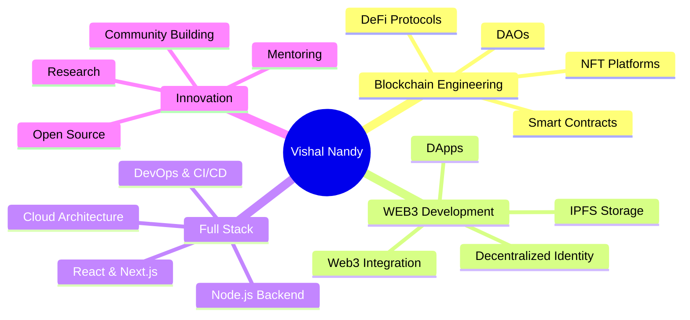

<div align="center">

<!-- Animated Header Banner -->


<!-- 3D Rotating Text -->


<!-- 3D Contribution Snake -->
<picture>
  <source media="(prefers-color-scheme: dark)" srcset="https://raw.githubusercontent.com/VishalNandy17/VishalNandy17/output/github-contribution-grid-snake-dark.svg">
  <source media="(prefers-color-scheme: light)" srcset="https://raw.githubusercontent.com/VishalNandy17/VishalNandy17/output/github-contribution-grid-snake.svg">
  
</picture>

</div>

<!-- Colorful Divider -->


<!-- Animated 3D Profile Card -->
<div align="center">
  
</div>

##  About Me

```javascript
const vishalNandy = {
    identity: {
        name: "Vishal Nandy",
        role: "Blockchain Engineer & WEB3 Architect",
        location: "Building on the Blockchain 🌍",
        status: "Crafting the Future of Web3 🚀"
    },
    
    expertise: {
        blockchain: ["Solidity", "Smart Contracts", "DeFi", "NFTs", "DAOs"],
        web3: ["Ethereum", "Polygon", "Hardhat", "Truffle", "Web3.js", "Ethers.js"],
        frontend: ["React", "Next.js", "TypeScript", "Tailwind CSS", "Three.js"],
        backend: ["Node.js", "Express", "GraphQL", "REST APIs"],
        cloud: ["AWS", "Azure", "GCP", "Docker", "Kubernetes"],
        database: ["MongoDB", "PostgreSQL", "Redis", "IPFS"]
    },
    
    currentMission: [
        "🔥 Building revolutionary DApps",
        "⚡ Architecting decentralized protocols",
        "🌟 Contributing to Web3 ecosystem",
        "🚀 Pushing blockchain boundaries"
    ],
    
    philosophy: "Code the future, one block at a time ⛓️✨"
};

console.log("Welcome to my Digital Workspace! 👨‍💻");
```

<div align="center">

<!-- 3D Animated Robot -->


</div>

---

<!-- 3D Trophy Showcase -->
<div align="center">

##  GitHub Trophies

[](https://github.com/ryo-ma/github-profile-trophy)

</div>

---

<!-- Tech Stack with 3D Icons -->
<div align="center">

##  Tech Arsenal & Weapons of Choice

### 🔗 Blockchain & WEB3 Technologies
<p>

</p>


### 💻 Frontend Development
<p>

</p>


### ⚙️ Backend & Cloud Infrastructure
<p>

</p>


### 🛠️ Tools & Platforms
<p>

</p>


</div>

<!-- 3D Divider -->


---

<!-- GitHub Stats with 3D Effect -->
<div align="center">

##  GitHub Statistics


<!-- 3D Activity Graph -->


</div>

---

<!-- Detailed GitHub Metrics -->
<div align="center">

##  Detailed GitHub Metrics


</div>

---

<!-- 3D Pinned Repositories -->
<div align="center">

##  Featured Projects

<a href="https://github.com/VishalNandy17">
  
</a>

</div>

---

<!-- WakaTime Stats -->
<div align="center">

##  Coding Activity

<!--START_SECTION:waka-->

<!--END_SECTION:waka-->

</div>

---

<!-- 3D Animated Achievements -->
<div align="center">

##  Achievements & Milestones


<!-- GitHub Achievements -->


</div>

---

<!-- Dynamic Quote Card -->
<div align="center">

##  Daily Developer Wisdom


<!-- Random Dev Quote -->


</div>

---

<!-- Social Media & Connect Section -->
<div align="center">

##  Let's Connect & Build Together

<p>
<a href="https://www.linkedin.com/in/vishal-nandy-7a04a427b/">
  
</a>
<a href="https://vishal-phi-drab.vercel.app/">
  
</a>
<a href="https://x.com/vishal_nandy20/">
  
</a>
<a href="https://instagram.com/__maybe.vishal__/">
  
</a>
<a href="https://github.com/VishalNandy17">
  
</a>
</p>

<!-- Animated Buttons -->
<p>
<a href="mailto:vishal@example.com">
  
</a>
<a href="https://vishal-phi-drab.vercel.app/">
  
</a>
<a href="https://github.com/VishalNandy17">
  
</a>
</p>

<!-- Profile Counter -->


</div>

---

<!-- Activity Feed -->
<div align="center">

##  Recent GitHub Activity

<!--START_SECTION:activity-->
<!--END_SECTION:activity-->

<!-- GitHub Activity Grid -->


</div>

---

<!-- Support Section -->
<div align="center">

##  Support My Work

<p>If you find my work valuable, consider supporting me!</p>

<a href="https://www.buymeacoffee.com/vishalnandy">
  
</a>
<a href="https://ko-fi.com/vishalnandy">
  
</a>

</div>

---

<!-- Dynamic Code GIF -->
<div align="center">
  
</div>

---

<!-- Inspirational Section -->
<div align="center">

##  Philosophy & Vision

```ascii
╔════════════════════════════════════════════════════════════════╗
║                                                                ║
║   "In a world of centralization, be the node that             ║
║    decentralizes. Build not just code, but trust.             ║
║    Create not just contracts, but communities.                ║
║    Shape not just the blockchain, but the future."            ║
║                                                                ║
║                          - Vishal Nandy                        ║
║                                                                ║
╚════════════════════════════════════════════════════════════════╝
```


### 🎯 Current Focus Areas



</div>

---

<!-- Skills Progress Bars -->
<div align="center">

##  Skill Proficiency

| Skill | Level |
|-------|-------|
| Blockchain Development |  |
| Smart Contracts (Solidity) |  |
| WEB3 Technologies |  |
| React & Next.js |  |
| Node.js & Backend |  |
| Cloud & DevOps |  |
| System Architecture |  |

</div>

---

<!-- Animated Footer -->
<div align="center">


### ⚡ *Building Tomorrow's Decentralized World, Today* ⚡

<p>
  
  
  
</p>

<!-- Animated Wave Footer -->


**💙 Made with passion by Vishal Nandy | © 2025 | Powered by Blockchain Technology**


</div>
